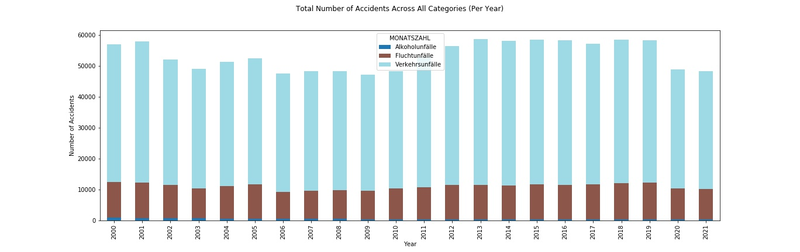
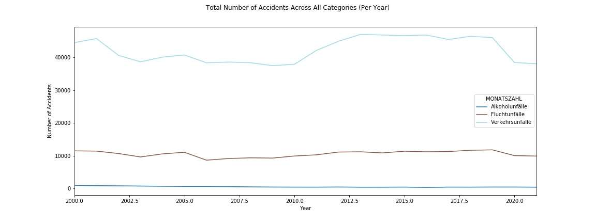
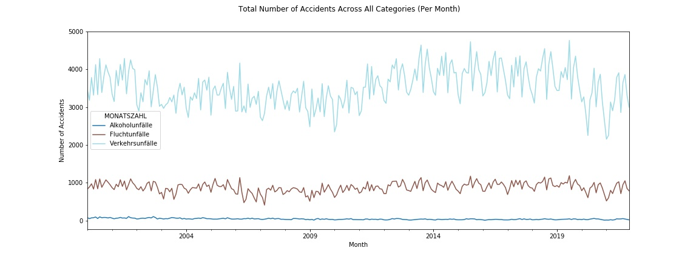
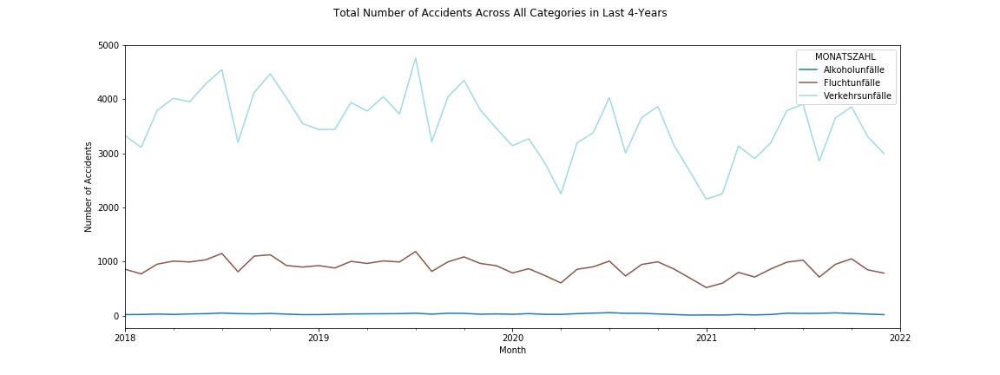
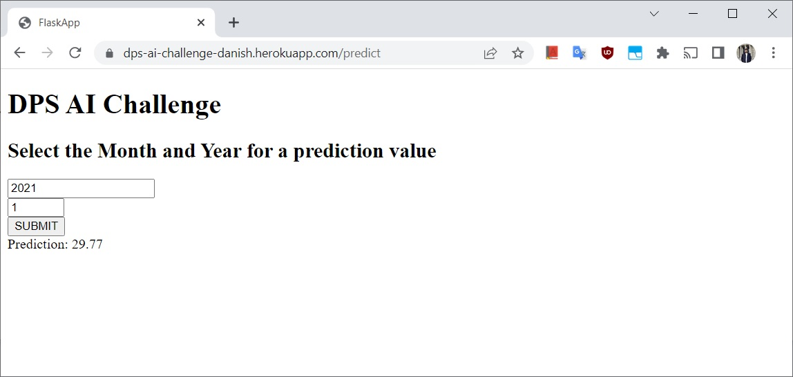

# dps_AI_challenge
DPS AI Challenge to predict number of accidents based on dataset from the München Open Data Portal

## Task Description:
```
Mission 1: Create a AI Model
Mission 2: Publish your source code & Deploy
Mission 3: Send us the URL of your work
```
### Dataset: 
“Monatszahlen Verkehrsunfälle” Dataset from the München Open Data Portal. It contains the number of accidents for specific categories per month. Important are the first 5 columns:
```
Category
Accident-type (insgesamt means total for all subcategories)
Year
Month
Value
```

### Goal:
To visualise historically the number of accidents per category (column1). The dataset currently contains values until the end of 2020. Create an application that forecasts the values for:

```
Category: 'Alkoholunfälle'
Type: 'insgesamt'
Year: '2022'
Month: '01'
```


## Visualizations:
Figures below show the number of accidents per category for the years 2000-2021.



Figure below shows the number of accidents for each category per month from the years 2000-2021.



Figure below shows the number of accidents for each category per month for the last 4 years.

  

## Deployed Model:
The completed model was successfully deployed on Heroku.  


